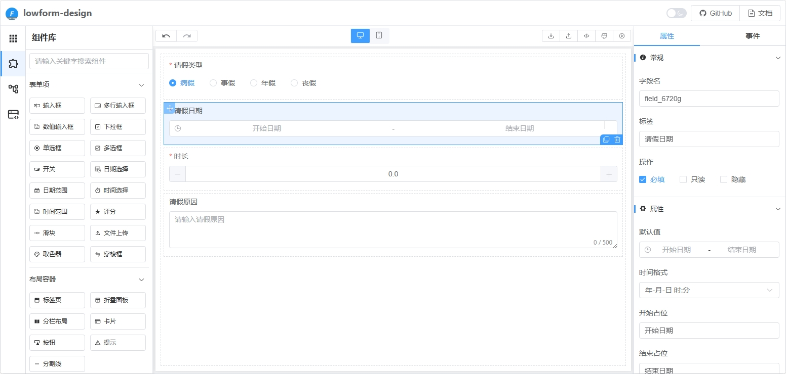
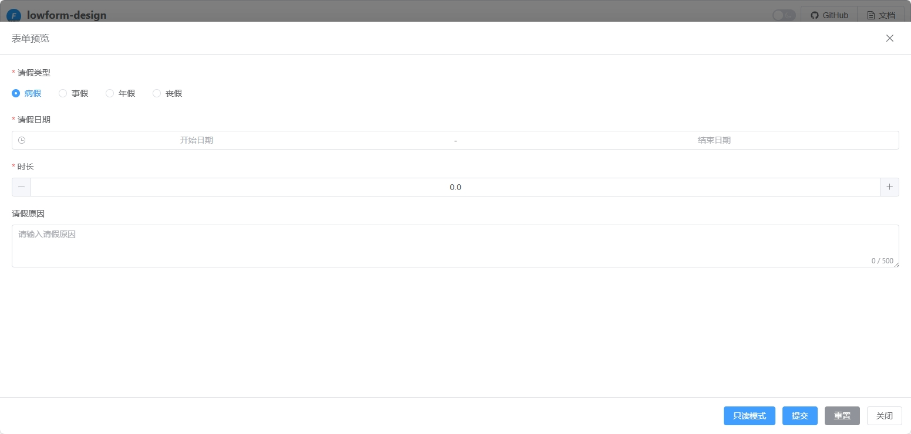
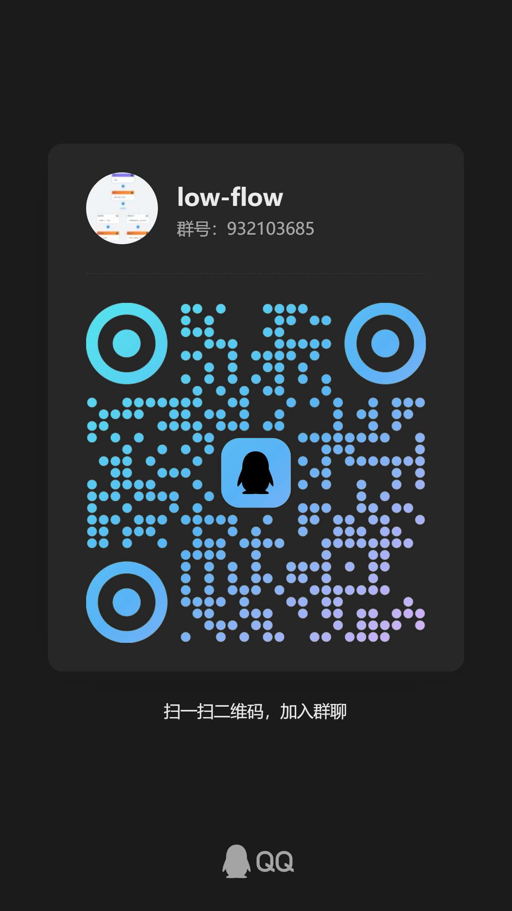

<div align="center">
    <h1>lowform-design</h1>
    <p>低代码表单设计器</p>
</div>

## 介绍

lowform-design是一个基于`Vue3`，`Vite`，`TypeScript`，`Element-Plus`等技术栈开发的，适用于低代码或无代码开发平台的表单设计器。
让普通人也能通过简单配置快速搭建表单。 <br />

## 在线预览

https://tsai996.github.io/lowform-design/

#### 成品案例

https://demo.lowflow.vip/

#### 项目源码

|        | 表单设计器                                          |
|--------|------------------------------------------------|
| github | https://github.com/tsai996/lowform-design      |
| 码云     | https://gitee.com/cai_xiao_feng/lowform-design |

#### 示例图

<p>
    
    
</p>

## 特性

| 组件    | 状态 |
|-------|----|
| 输入框   | ✅  |
| 多行输入框 | ✅  |
| 数值输入框 | ✅  |
| 下拉框   | ✅  |
| 单选框   | ✅  |
| 多选框   | ✅  |
| 开关    | ✅  |
| 日期选择  | ✅  |
| 日期范围  | ✅  |
| 时间选择  | ✅  |
| 时间范围  | ✅  |
| 评分    | ✅  |
| 滑块    | ✅  |
| 文件上传  | ✅  |
| 取色器   | ✅  |
| 穿梭框   | ✅  |
| 标签页   | ✅  |
| 折叠面板  | ✅  |
| 分栏布局  | ✅  |
| 卡片    | ✅  |
| 按钮    | ✅  |
| 提示    | ✅  |
| 分割线   | ✅  |

##  表单解析渲染
下载依赖
```shell
npm install @xfc/vue3-form-render
```
注册表单解析
```typescript
import { useFormRender } from '@xfc/vue3-form-render'

const { Render, FormRender, addComponent, removeComponent, components, hooks } = useFormRender()
export { Render, FormRender }
```
二次封装添加 el-form-item 父元素，以支持element plus表单
```html
<script setup lang="ts">
  import { FormRender } from './context'
  
  const formRef = ref<FormInstance>()
  const buildRule = (field: FormField) => {
    const { props, rules } = field
    let ruleList: FormItemRule[] = []
    if (Array.isArray(rules)) {
      ruleList.push(
        ...rules.map((rule) => {
          return {
            pattern: rule.pattern && new RegExp(rule.pattern),
            message: `请输入正确的${rule.message}`
          }
        })
      )
    }
    if (field.required !== undefined) {
      const required: FormItemRule = {
        required: field.required || false,
        message: props.placeholder
      }
      if (Array.isArray(field.value)) {
        required.type = 'array'
        required.message = `请至少选择一个${field.label}`
        required.trigger = 'change'
      }
      required.message === undefined && (required.message = `${field.label}不能为空`)
      ruleList.push(required)
    }
    return ruleList
  }
</script>

<template>
  <FormRender ref="formRef" :model="formData" :formData="formData" :field="field" v-bind="$attrs">
    <template #formItem="{ node, field }">
      <el-form-item
        v-if="!field.hidden"
        :prop="field.id"
        :label="field.hideLabel ? undefined : field.label"
        :label-width="field.hideLabel ? '0px' : undefined"
        :required="field.required"
        :rules="buildRule(field)"
      >
        <component :is="node"></component>
      </el-form-item>
    </template>
  </FormRender>
</template>
```
解析表单
```html
<script setup lang="ts">
  import FormParser from '@/components/FormParser/index.vue'

  const field = ref<FormField>({...})
  const formData = ref<Recordable>({})
  const formParserRef = ref<InstanceType<typeof FormParser>>()
</script>

<template>
  <FormParser
    ref="formParserRef"
    :formData="formData"
    :field="field"
  >
  </FormParser>
</template>
```
## 添加微信好友拉入群聊（备注：加群）
<p>
    
    
</p>

## 赞助

开源不易如果该项目对您有帮助，您可以请我喝杯奶茶。
<p>
    
    
</p>

## 推荐

大家在使用本项目时，推荐结合贺波老师的书
[《深入Flowable流程引擎：核心原理与高阶实战》](https://item.jd.com/14804836.html)学习。这本书得到了Flowable创始人Tijs Rademakers亲笔作序推荐，对系统学习和深入掌握Flowable的用法非常有帮助。

