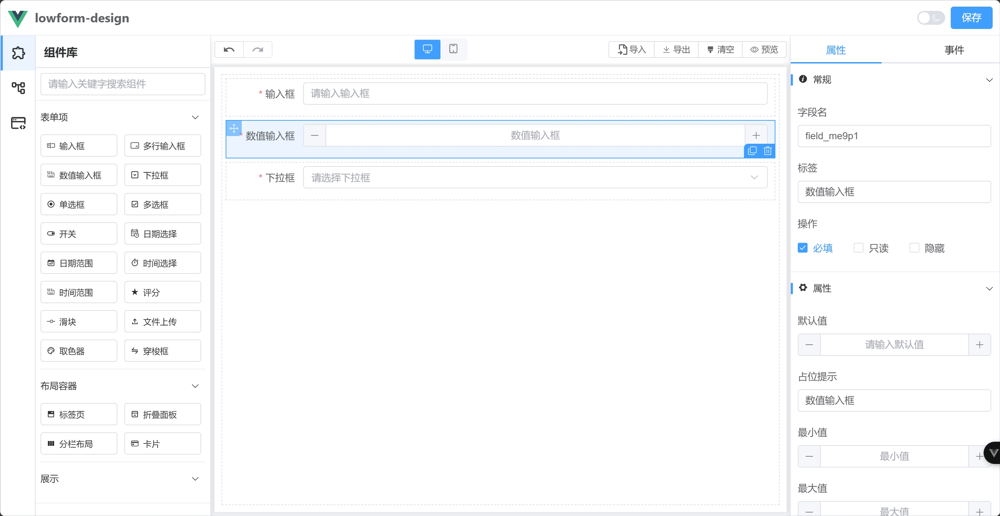
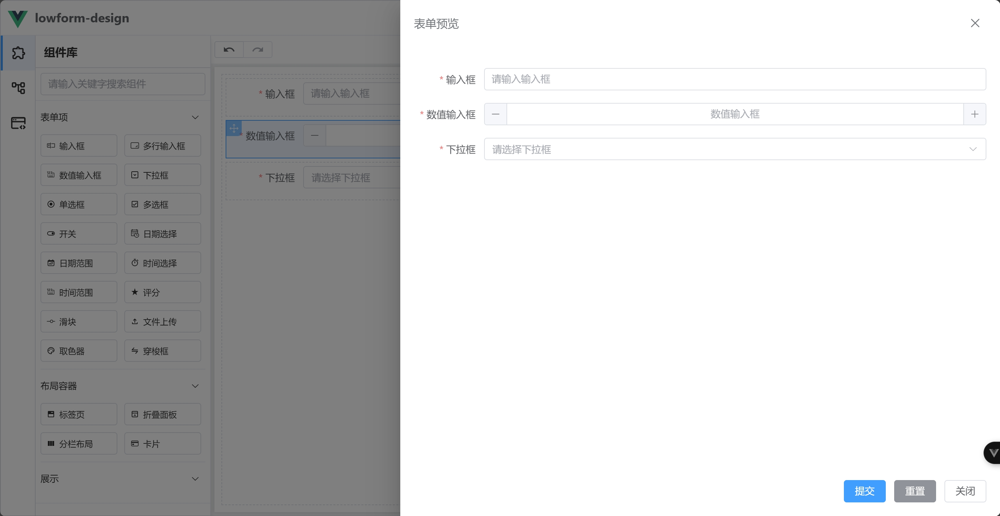

    <h1>lowform-design</h1>
    
低代码表单设计器

## 介绍

lowform-design是一个基于`Vue3`，`Vite`，`TypeScript`，`Element-Plus`等技术栈开发的，适用于低代码或无代码开发平台的表单设计器。
让普通人也能通过简单配置快速搭建表单。  

## 在线预览

https://tsai996.github.io/lowform-design/

#### 成品案例

https://demo.lowflow.vip/

#### 项目源码

|        | 表单设计器                                          |
|--------|------------------------------------------------|
| github | https://github.com/tsai996/lowform-design      |
| 码云     | https://gitee.com/cai_xiao_feng/lowform-design |

#### 示例图

    
    

## 特性

| 组件    | 状态 |
|-------|----|
| 输入框   | ✅  |
| 多行输入框 | ✅  |
| 数值输入框 | ✅  |
| 下拉框   | ✅  |
| 单选框   | ✅  |
| 多选框   | ✅  |
| 开关    | ✅  |
| 日期选择  | ✅  |
| 日期范围  | ✅  |
| 时间选择  | ✅  |
| 时间范围  | ✅  |
| 评分    | ✅  |
| 滑块    | ✅  |
| 文件上传  | ✅  |
| 取色器   | ✅  |
| 穿梭框   | ✅  |
| 标签页   | ✅  |
| 折叠面板  | ✅  |
| 分栏布局  | ✅  |
| 卡片    | ✅  |

## 添加微信好友拉入群聊（备注：加群）

    
    

## 赞助

开源不易如果该项目对您有帮助，您可以请我喝杯奶茶。

    
    

## 推荐

大家在使用本项目时，推荐结合贺波老师的书
[《深入Flowable流程引擎：核心原理与高阶实战》](https://item.jd.com/14804836.html)学习。这本书得到了Flowable创始人Tijs Rademakers亲笔作序推荐，对系统学习和深入掌握Flowable的用法非常有帮助。

