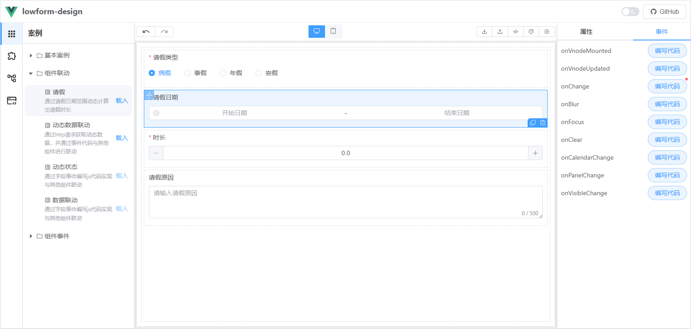

# 动态计算
动态计算是指组件B的值由其他组件的值通过计算得到。
这种机制常用于表单中需要根据用户输入动态更新某些字段的场景。以下是两个典型示例：
## 1. 示例1：订单总价格
订单总价格由单价乘以数量得到。
实现逻辑
* 监听**单价**和**数量**字段的值变化。
* 当任一字段的值发生变化时，重新计算总价格并更新到**总价格**字段。

代码示例：
```javascript
const { gformData } = $inject;
const unitPrice = formData.unitPrice || 0;
const quantity = formData.quantity || 0;
formData.totalPrice = unitPrice * quantity;
```
## 2. 示例2：请假时长
以下是一个完整的请假时长动态计算示例：

实现逻辑
* 监听**请假时间**字段的值变化。
* 当**请假时间**的值发生变化时，计算时间差并转换为天数，更新到**请假时长**字段。

代码示例：
```javascript
const {getField,formData} = $inject
const value = event[0]
const timestamp = new Date(value[1]).getTime() - new Date(value[0]).getTime()
formData.field_ykkfx = timestamp /1000/60/60/24
```
## 3. 完整示例
请前往 [在线预览](https://tsai996.github.io/lowform-design/) ，案例/组件联动/请假，查看完整案例。
