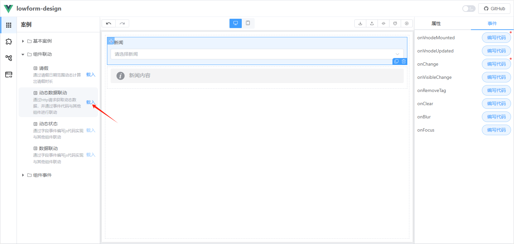

# http请求
组件的数据源通常需要通过 HTTP 请求从后端接口获取。
以下是关于如何在组件中通过 HTTP 请求获取数据并动态更新组件属性的详细说明和示例。

## 1. 实现步骤
### 1.1 注入 HTTP 请求对象
首先，需要将 HTTP 请求对象注入到表单解析器中。具体方法请参考：[注入方法/属性](../form-parser#_6-注入方法-属性)。
### 1.2 在 **onVnodeMounted** 事件中编写请求代码
在组件的 `onVnodeMounted` 生命周期事件中，通过 `$inject` 获取 HTTP 对象，并调用其 `request` 方法发送请求。
将响应结果赋值给组件的 `field.props.options` 属性。
## 2. 代码示例
以下是一个完整的示例，展示如何通过 HTTP 请求获取数据并更新组件的选项列表：
```javascript
const http = $inject.http
http.request({
  url: '/api/news/list'
}).then(res=>{
  if(res.success){
    field.props.options = res.data.map(e=>{
      return {
        label: e.title,
        value: e.id
      }
    })
  }
}).catch(err => {
    console.error('请求失败:', err);
});
```
## 3. 示例说明
### 3.1 请求地址
* `url`：后端接口地址，例如 `/api/news/list`。
### 3.2 响应数据处理
* `res.data`：假设后端返回的数据格式为数组，每个元素包含 `id` 和 `title` 字段。
* `field.props.options`：将响应数据映射为组件需要的格式，`label` 用于显示文本，`value` 用于选项值。
### 3.3 组件更新
* 当请求成功后，`field.props.options` 会被更新，组件将根据新的选项列表重新渲染。

## 4. 完整示例：
请前往 [在线预览](https://tsai996.github.io/lowform-design/) ，案例/组件联动/动态数据联动，查看完整案例。

