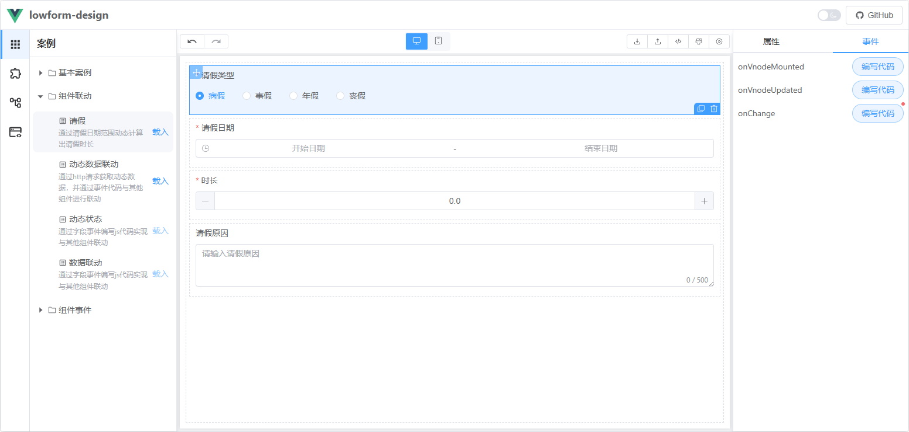

# 组件联动
组件联动是指当一个组件（组件A）触发某个事件时，另一个组件（组件B）的状态会根据特定条件发生改变。以下是一个请假案例的示例：
## 1. 示例场景
当**请假类型**为**事假**时，**请假原因**字段为必填；否则，**请假原因**字段为非必填。
## 2. 代码实现
通过监听组件A（请假类型）的值变化，动态设置组件B（请假原因）的必填状态。以下为代码示例：
```javascript
const {getField} = $inject
const yy = getField('field_h75fl')
const value = event[0]
if(value == 2){
  yy.required = true
}else{
  yy.required = false
}
```
### 代码说明
1. `getField`：用于获取表单中指定字段的组件对象。
2. `event[0]`：表示组件A（请假类型）的当前值。
3. **条件判断**：如果组件A的值为 `2`（代表“事假”），则将组件B（请假原因）的 `required` 属性设置为 `true`，否则设置为 `false`。

## 3. 完整案例
请前往 [在线预览](https://tsai996.github.io/lowform-pages/) ，案例/组件联动/请假，查看完整案例。
