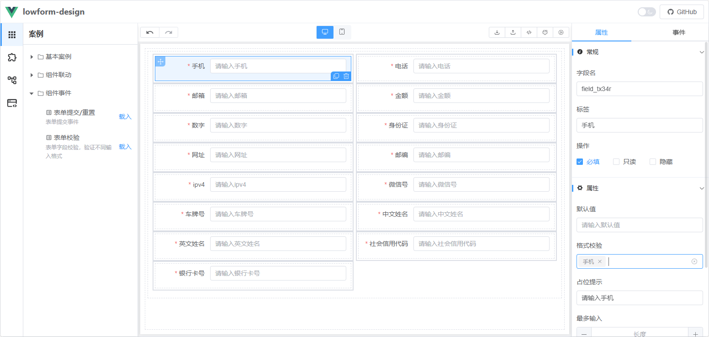

# 规则校验
规则校验用于确保用户输入的内容符合特定格式或条件。通过在 `FormField` 对象的 `rules` 属性中配置校验规则，可以实现对输入内容的动态校验。
以下是关于规则校验的详细说明和示例：
## 1. 规则校验配置
在 `FormField` 对象中，`rules` 属性用于定义校验规则。每个规则通常包含以下字段：
* `pattern`：正则表达式，用于匹配输入内容。
* `message`：校验失败时显示的错误提示信息。
## 2. 示例：手机号格式校验
以下是一个手机号格式校验的配置示例：
```json
{
  "id": "field_tx34r",
  "name": "Input",
  "type": "formItem",
  "label": "手机",
  "value": null,
  "rules": [
    {
      "pattern": "^(0|86|17951)?(13[0-9]|15[012356789]|166|17[3678]|18[0-9]|14[57])[0-9]{8}$",
      "message": "手机"
    }
  ],
  ...
}
```
### 3. 常见校验规则示例
以下是一些常见的输入格式校验规则示例：
#### 邮箱格式校验
```json
{
  "pattern": "^[a-zA-Z0-9._%+-]+@[a-zA-Z0-9.-]+\\.[a-zA-Z]{2,}$",
  "message": "请输入有效的邮箱地址"
}
```
#### URL地址校验
```json
{
  "pattern": "^(https?:\\/\\/)?([\\da-z.-]+)\\.([a-z.]{2,6})([\\/\\w .-]*)*\\/?$",
  "message": "请输入有效的URL地址"
}
```
#### 身份证号码校验
```json
{
  "pattern": "^\\d{17}[\\dXx]$",
  "message": "请输入有效的身份证号码"
}
```
## 3. 完整示例
完整例子请查看：

选中组件在右侧属性面板的 **格式校验** 选择对应的校验正则。

