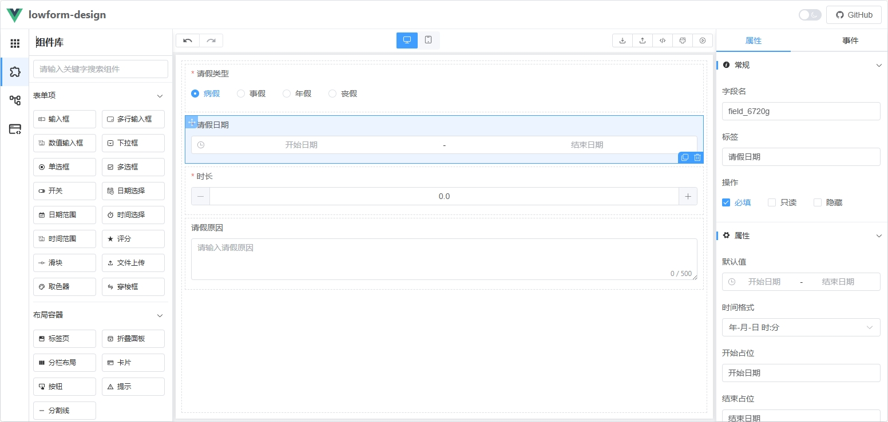

# 简介

:::tip LowForm
LowForm 是一款功能强大的低代码表单设计器，支持通过拖拽组件快速构建表单页面。它能够以极少的代码实现复杂的表单逻辑，并通过 hook 方式将数据解析为不同的 UI 组件，极大地提升了开发效率和灵活性。
:::

## 1. 组件库
组件库提供了两种便捷的字段添加方式：
* **点击组件：** 点击组件自动添加到画板中，会自动选中该组件。
* **拖拽组件：** 将组件拖拽到画板中，会自动选中该组件。
## 2. 表单画板
表单画板是用户设计和布局表单的核心区域。用户可以通过组件库添加的组件在画板中进行自由排列和组合，实时预览表单的布局效果。画板支持以下功能：
* **组件调整位置：** 用户可以通过拖拽组件来调整其在画板中的位置。
* **组件属性配置：** 选中画板中的组件后，右侧属性面板会显示该组件的详细配置选项，用户可以根据需求进行修改。
* **组件复制/删除：** 点击选中组件右下角的操作按钮，即可快速复制或删除组件。

通过直观的拖拽操作和实时预览，LowForm 极大地简化了表单设计的流程，帮助用户快速构建出符合需求的表单页面。
## 3. 属性面板
属性面板是用户配置组件属性的核心区域。当用户选中画板中的组件时，属性面板会动态显示该组件的可配置选项，包括但不限于：
* **常规：** 如字段名、标签、操作（必填、只读、隐藏）等。
* **属性：** 默认值以及组件的其他属性。
* **事件：** 配置组件的交互行为，如点击事件、输入变化事件等，支持自定义逻辑绑定。

属性面板的设计直观易用，支持实时预览修改效果，帮助用户快速调整组件的显示效果和交互行为，确保表单满足业务需求。
## 4. 工具栏
工具栏包含多个常用操作，提升表单设计效率：
* **撤回/恢复：** 撤回或恢复历史操作记录，轻松修改设计。
* **电脑/手机切换：** 切换不同平台（电脑/手机）展示效果，确保跨平台兼容。
* **导出/导入：** 支持导入已有表单数据或导出已完成设计的表单。
* **生成代码：** 一键生成 Vue 代码并下载，快速与项目对接。
* **清空/预览：** 清空画板内容或点击预览，查看最终渲染效果。

通过这些功能，LowForm 让表单设计、导出和集成变得更加高效、直观。